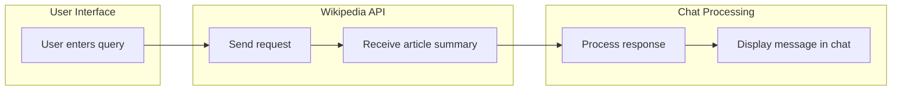

PICTOPEDIA is a modern **Wikipedia Search Chatbot** built using **HTML, CSS, and JavaScript**.
It allows users to search topics, ask questions, and retrieve information directly from **Wikipedia APIs** through an interactive conversational interface.

The application includes **multi-chat sessions, multilingual search, voice input, and conversation export features**, providing a rich and interactive knowledge exploration experience. 🚀

---

# 🔗 Live Demo

Try the deployed application here:

**PICTOPEDIA — Wikipedia Search Chatbot**
🌐 https://word-search-chatbot-using-wikipedia.vercel.app/

---

# 🚀 Project Overview

This project demonstrates how to build a **client-side conversational chatbot** that retrieves and displays knowledge from Wikipedia.

The workflow involves the following steps:

### 1️⃣ User Query Input

The user enters a question or search query in the chat interface.

Example:
What is Artificial Intelligence

---

### 2️⃣ Query Processing

The application processes the user query and prepares it for Wikipedia API requests.

The chatbot also handles simple conversational messages such as:

* Hello
* Hi
* Thank you
* Goodbye

These responses are generated locally without external API calls.

---

### 3️⃣ Wikipedia API Request

The chatbot sends a request to the **Wikipedia REST API** to retrieve article summaries.

API example:

https://en.wikipedia.org/api/rest_v1/page/summary/query

If the exact page is not found, the application uses the **Wikipedia OpenSearch API** to find the best matching article.

---

### 4️⃣ Response Processing

The retrieved Wikipedia data includes:

* Article title
* Summary description
* Preview image
* Wikipedia article link

This information is formatted and displayed inside the chatbot conversation.

---

### 5️⃣ Displaying the Response

The chatbot shows the response as a **chat message**, including:

* Article summary
* Image preview (if available)
* Link to the full Wikipedia page

---

### 6️⃣ Chat Session Management

The application supports **multiple chat sessions**.

Each session allows:

* Rename chat
* Pin / Unpin chat
* Delete chat
* Save conversation history

All chat sessions are stored in **browser localStorage**.

---

### 7️⃣ Voice Interaction

The chatbot supports voice interaction using browser APIs.

Voice Input:

* SpeechRecognition API converts speech into text.

Text-to-Speech:

* SpeechSynthesis API reads chatbot responses aloud.

---

# 🚀 Key Features

* Interactive **chat-based Wikipedia search**
* **Multi-chat sessions** with history persistence
* **Multilingual Wikipedia search**
* **Voice input** using Web Speech API
* **Text-to-speech responses**
* **Image preview support**
* **Conversation search**
* **Export chat as TXT or PDF**
* Modern **Glassmorphism UI**
* **Dark / Light theme toggle**
* Fully **responsive layout**

---

# 🧰 Tech Stack

* **HTML5** — Application structure
* **CSS3** — UI styling and responsive layout
* **JavaScript (ES6+)** — Application logic
* **Wikipedia REST API** — Article summaries
* **Wikipedia OpenSearch API** — Query resolution
* **Web Speech API** — Speech-to-text input
* **SpeechSynthesis API** — Text-to-speech output
* **LocalStorage** — Chat session persistence

---

# 📁 Project Structure

Word-Search-Chatbot-Using-Wikipedia

index.html — Application UI layout
style.css — Styling and responsive design
script.js — Chat logic and API integration
README.md — Project documentation

---

# ⚙️ How It Works

### Initialization

When the application loads, the `init()` function performs the following:

* Loads saved theme preferences
* Loads language settings
* Retrieves stored chat sessions
* Creates a new session if none exists
* Binds UI event listeners

---

### Sending a Message

When a user sends a message:

1. Capture the user input
2. Display the user message
3. Request data from Wikipedia API
4. Process the response
5. Display the chatbot reply

---

### Data Returned from Wikipedia

The chatbot extracts the following fields:

* Title
* Extract (summary)
* Thumbnail image
* Article URL

---

# 🔍 Example Query

User Input:

What is Machine Learning

Chatbot Response:

Machine learning is a field of artificial intelligence that enables systems to learn from data and improve their performance without explicit programming.

---

# 📊 Application Workflow

---

# 🚀 Run Locally

Run a local server:

python3 -m http.server 4173

Then open in browser:

http://localhost:4173

---

# 💡 Future Improvements

* AI-powered conversational responses
* Context-aware chat memory
* Image gallery search
* Knowledge graph visualization
* Chat analytics dashboard
* Improved multilingual support

---

## 👨‍💻 Author  

**Lomada Siva Gangi Reddy**  
- 🎓 B.Tech CSE (Data Science), RGMCET (2021–2025)  
- 💡 Interests: Python | Machine Learning | Deep Learning | Data Science  
- 📍 Open to **Internships & Job Offers**

 **Contact Me**:  

- 📧 **Email**: lomadasivagangireddy3@gmail.com  
- 📞 **Phone**: 9346493592  
- 💼 [LinkedIn](https://www.linkedin.com/in/lomada-siva-gangi-reddy-a64197280/)  🌐 [GitHub](https://github.com/shivareddy2002)  🚀 [Portfolio](https://lsgr-portfolio-pulse.vercel.app/)

---

